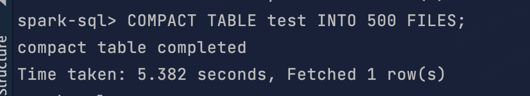

## 实现 Compact table command
这周作业跟第九周的show version作业相似
1. 先需要在SqlBase.g4中添加自定义关键字:
```antlrv4
statement
    ...
    | COMPACT TABLE target=tableIdentifier partitionSpec?
        (INTO fileNum=INTEGER_VALUE identifier)?                       #compactTable
```
2. 然后运行maven antlr4插件 生成CompactTableContext; 并在SparkSqlParser类里 实现visitCompactTable方法:
```scala
override def visitCompactTable(ctx: CompactTableContext): LogicalPlan = withOrigin(ctx) {
    val table: TableIdentifier = visitTableIdentifier(ctx.target)
    val fileNum: Option[Int] = Option(ctx.INTEGER_VALUE()).map(_.getText.toInt)
    CompactTableCommand(table, fileNum)
  }
```
3. 然后新建个CompactTableCommand类，并自己实现RunnableCommand的 run方法:
因为最开始自定义的compact table的 文件数量是非必填，所以此处定义fileNum可为空；当fileNum为空时，就按照题目要求 fileNum=文件总大小/128MB
再通过repartition方法调用 来实现具体的合并功能;
```scala
case class CompactTableCommand(table: TableIdentifier,
                               fileNum: Option[Int]) extends LeafRunnableCommand {


    override def output: Seq[Attribute] = Seq(AttributeReference("compactReturn", StringType, nullable = false)())

    override def run(sparkSession: SparkSession): Seq[Row] = {
        val dataFrame = sparkSession.table(table)
        val num = fileNum match {
            case Some(value) => value
            // default value 128mb per file
            case _ => (sparkSession.sessionState.executePlan(dataFrame.queryExecution.logical)
                .optimizedPlan.stats.sizeInBytes / (1024L * 1024L * 128) ).toInt
        }
        log.info(s"fileNum is $num")
        val tmpTable = table.identifier + "_tmp"
        dataFrame.write.mode(SaveMode.Overwrite).saveAsTable(tmpTable)
        sparkSession.table(tmpTable).repartition(num).write.mode(SaveMode.Overwrite).saveAsTable(table.identifier)
        sparkSession.sql(s"drop table if exists $tmpTable")
        log.info("compact table completed")
        Seq(Row("compact table completed"))
    }
}
```
4. 最后重新编译spark，并进入spark-sql console里：
```shell
mvn clean package  -Phive -Phive-thriftserver -DskipTests
./bin/spark-sql
```
最后测试结果：

